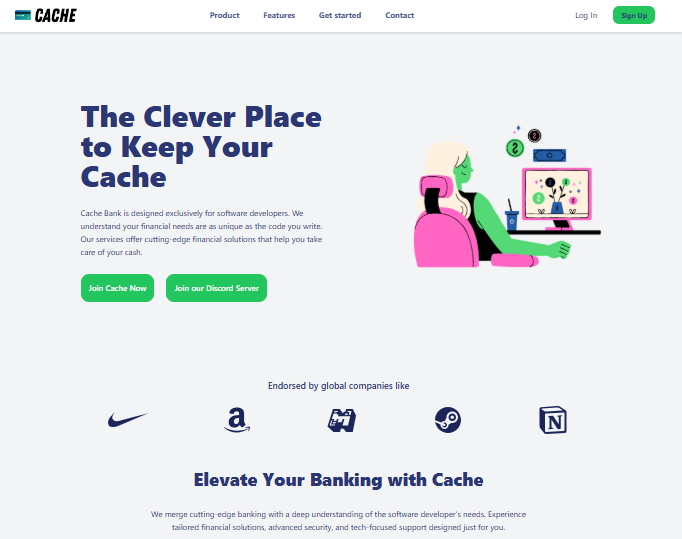

# Installation

```
# Install dependencies
npm install

# Start the development server with live preview using Browsersync
npm run browsersync

# Compile Tailwind CSS
npm run build

# Compile Tailwind CSS minified
npm run build-minify

```

# Project Summary

Stack - HTML , CSS3, Tailwind CSS, Javascript

The request was to build a Cache Bank's landing page, a web page tailored for software developers. The expectation was to stress test the knowledge and skill gained using the stack above. During development, the project was broken down into five components as stipulated below:

## Project Breakdown

- Project Setup and Responsive Navigation
- Hero and endorsements
- Features
- Stats and Getting Started
- Contact and Footer

The outcome is similar to the below picture:


Check out these links for more information on the project.

# Presentation Slide

# Loom Presentation []
